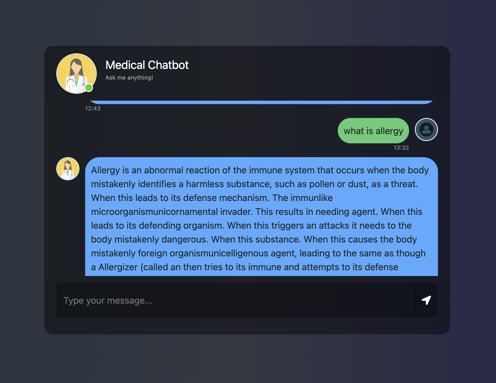

# 🩺 Medical Chatbot using LLaMA2

Build a domain-specific medical chatbot powered by LLaMA2, LangChain, and Pinecone, with a Flask web interface. This project uses Retrieval-Augmented Generation (RAG) to provide accurate, context-aware answers from a medical knowledge base.

---

## 🚀 Key Features

- **LLaMA2 (CTransformers):** Efficient, quantized local inference.
- **LangChain:** Prompt templates, RetrievalQA chain, and response generation.
- **Pinecone Vector DB:** Semantic search over medical documents.
- **RAG:** Combines LLM reasoning with verified context.
- **Flask Web App:** Interactive chatbot UI.
- **Custom Prompts:** Tailored for medical Q&A accuracy.

---

## 🛠️ Tech Stack

- **Backend:** Python, Flask, LangChain
- **LLM:** LLaMA2 (GGML, CTransformers)
- **Embeddings:** HuggingFace all-MiniLM-L6-v2
- **Database:** Pinecone
- **Frontend:** HTML, CSS, Jinja2

---

## 📂 Project Structure

```
├── app.py                # Main Flask app
├── store_index.py        # Embedding & Pinecone indexing
├── template.py           # Custom prompt templates
├── requirements.txt      # Dependencies
├── setup.py              # Package setup
├── data/                 # Medical dataset
├── model/                # Quantized LLaMA2 model
├── src/                  # Helper functions
├── research/             # Experimentation notebooks
├── templates/            # HTML frontend
├── static/               # CSS/JS assets
```

---

## ⚡ How It Works

1. **Data Preparation:** Medical texts → embeddings (HuggingFace).
2. **Indexing:** Store embeddings in Pinecone.
3. **Query Handling:** User query → embedding → retrieve relevant chunks.
4. **Answer Generation:** Query + context → LLaMA2 → grounded answer.
5. **Frontend:** Flask chat UI for user interaction.

---

## ▶️ Getting Started

1. **Clone the repo:**
   ```bash
   git clone https://github.com/entbappy/End-to-end-Medical-Chatbot-using-Llama2.git
   cd End-to-end-Medical-Chatbot-using-Llama2
   ```
2. **Install dependencies:**
   ```bash
   pip install -r requirements.txt
   ```
3. **Add your Pinecone API key in `.env`.**
4. **Build the index:**
   ```bash
   python store_index.py
   ```
5. **Run the app:**
   ```bash
   python app.py
   ```
6. **Open [http://localhost:8080](http://localhost:8080) in your browser.**

---

## 📌 Use Cases

- Medical information retrieval
- Healthcare chat assistants
- Domain-specific Q&A
- RAG demonstration

---

## 🖼️ UI Screenshot

